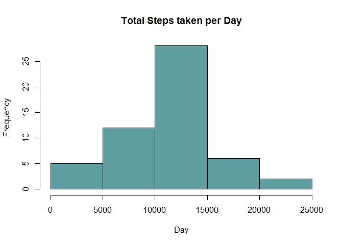
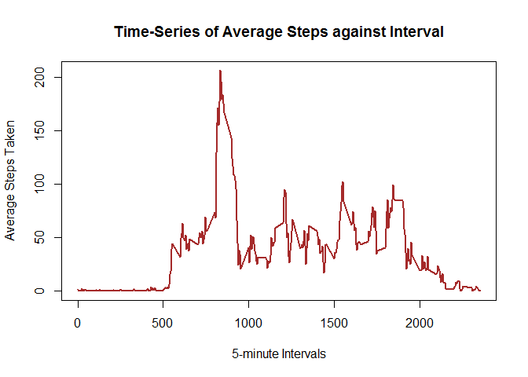
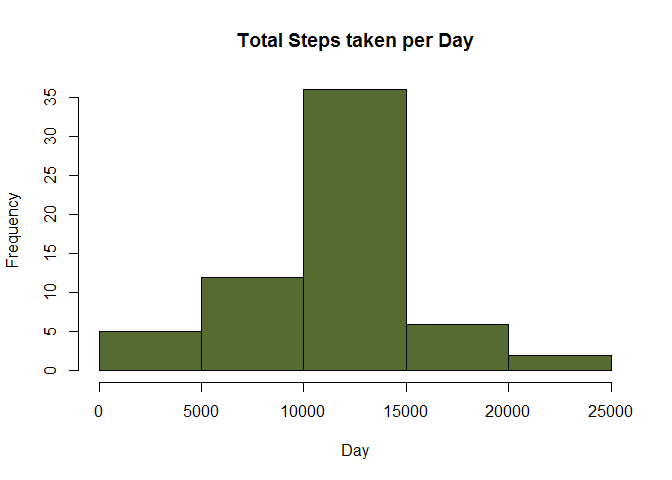

# Reproducible Research: Peer Assessment 1


## Loading and preprocessing the data

```r
data <- read.csv("activity.csv", header=TRUE)
View(data)
str(data)
```

```
## 'data.frame':	17568 obs. of  3 variables:
##  $ steps   : int  NA NA NA NA NA NA NA NA NA NA ...
##  $ date    : Factor w/ 61 levels "2012-10-01","2012-10-02",..: 1 1 1 1 1 1 1 1 1 1 ...
##  $ interval: int  0 5 10 15 20 25 30 35 40 45 ...
```


## What is mean total number of steps taken per day?

#### Make a histogram of the total number of steps taken each day

```r
steps_per_day <- aggregate(steps ~ date, data, sum)$steps

hist(steps_per_day,  main="Total Steps taken per Day", xlab="Day", ylab="Frequency", col = "cadetblue")
```

 

#### Calculate and report the mean and median total number of steps taken per day

```r
mean(steps_per_day)
```

```
## [1] 10766.19
```

```r
median(steps_per_day)
```

```
## [1] 10765
```
The mean number of steps taken per day is 10766.19 and the median number of steps taken per day is 10765.

## What is the average daily activity pattern?

#### Make a time series plot (i.e. type = "l") of the 5-minute interval (x-axis) and the average number of steps taken, averaged across all days (y-axis)

```r
steps_per_interval <- aggregate(steps ~ interval, data, FUN = mean)

plot(steps_per_interval, type = "l", main="Time-Series of Average Steps against Interval", xlab="5-minute Intervals", ylab="Average Steps Taken", col="brown", lwd="2")
```

 

#### Which 5-minute interval, on average across all the days in the dataset, contains the maximum number of steps?

```r
steps_per_interval$interval[which.max(steps_per_interval$steps)]
```

```
## [1] 835
```

On average, the maximum number of steps occur at 0835.

## Imputing missing values

#### Calculate and report the total number of missing values in the dataset
(i.e. the total number of rows with NAs)

```r
data_NA <- sum(is.na(data))
data_NA
```

```
## [1] 2304
```

There are 2304 missing values in the dataset.

#### Devise a strategy for filling in all of the missing values in the dataset. The strategy does not need to be sophisticated. For example, you could use the mean/median for that day, or the mean for that 5-minute interval, etc.

Using the mean to replace the missing values:

```r
mean_steps <- aggregate(steps ~ interval, data, FUN = mean)
fillNA <- numeric()
for (i in 1:nrow(data)) {
    obs <- data[i, ]
    if (is.na(obs$steps)) {
        steps <- subset(mean_steps, interval == obs$interval)$steps
    } else {
        steps <- obs$steps
    }
    fillNA <- c(fillNA, steps)
}
```


#### Create a new dataset that is equal to the original dataset but with the missing data filled in.


```r
new_data <- data
new_data$steps <- fillNA
```


#### Make a histogram of the total number of steps taken each day and Calculate and report the mean and median total number of steps taken per day. 


```r
new_steps_per_day <- aggregate(steps ~ date, new_data, sum, na.rm = TRUE)

hist(new_steps_per_day$steps,  main="Total Steps taken per Day", xlab="Day", ylab="Frequency", col = "darkolivegreen")
```

 

```r
mean(new_steps_per_day$steps)
```

```
## [1] 10766.19
```

```r
median(new_steps_per_day$steps)
```

```
## [1] 10766.19
```
The mean number of steps taken per day is 10766.19 and the median number of steps taken per day is 10766.19.


#### Do these values differ from the estimates from the first part of the assignment? What is the impact of imputing missing data on the estimates of the total daily number of steps?

The mean remains unchanged at 10766.19 while the median increase slightly from 10765 to 10766.19. The most obvious difference is the jump in frequency for the middle bar of the new histogram.


## Are there differences in activity patterns between weekdays and weekends?

#### Create a new factor variable in the dataset with two levels - "weekday" and "weekend" indicating whether a given date is a weekday or weekend day.


```r
dateDayType <- data.frame(sapply(X = new_data$date, FUN = function(day) {
    if (weekdays(as.Date(day)) %in% c("Monday", "Tuesday", "Wednesday", "Thursday", "Friday")) {
        day <- "weekday"
    } else {
        day <- "weekend"
    }
}))

newData_DayType <- cbind(new_data, dateDayType)

colnames(newData_DayType) <- c("Steps", "Date", "Interval", "DayType")

dayTypeIntervalSteps <- aggregate(
    data=newData_DayType,
    Steps ~ DayType + Interval,
    FUN=mean
)
```


#### Make a panel plot containing a time series plot (i.e. type = "l") of the 5-minute interval (x-axis) and the average number of steps taken, averaged across all weekday days or weekend days (y-axis).


```r
library("lattice")

xyplot(
    type="l",
    data=dayTypeIntervalSteps,
    Steps ~ Interval | DayType,
    xlab="Interval",
    ylab="Number of steps",
    layout=c(1,2)
)
```

 

During weekdays, this person walks more in the morning and walk less in the afternoon as compared to weekends.
